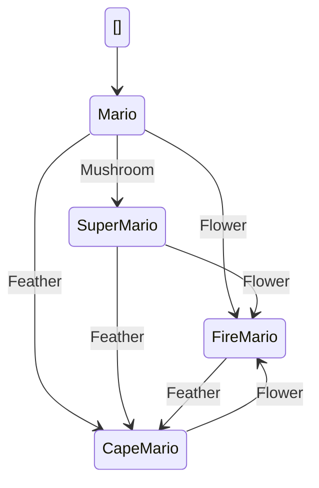

# MarioStateMachine

This is an automatically generated state machine implementation based on a Mermaid.js state diagram.

## Project Structure

- `MarioStateMachine/` - Main library project containing the state machine implementation
  - `States/` - Contains all state classes
    - `IMarioState.cs` - Interface defining state behavior
    - Individual state implementation files
  - `Mario.cs` - Main state machine class
  - `MarioLogger.cs` - Logger for state transitions

- `MarioStateMachineTests/` - Test project
  - `States/` - Contains test classes for each state

## State Machine Overview

The state machine implements the following states:
- `Mario`
- `SuperMario`
- `FireMario`
- `CapeMario`

Available transitions:
- `Mushroom`
- `Flower`
- `Feather`

## Getting Started

1. Open the solution in Visual Studio 2022 or later
2. Build the solution
3. Run the tests to verify the implementation

## Usage Example

```csharp
using SuperMarioExample;
using SuperMarioExample.States;

// Create a new instance with optional logger
var logger = new MarioLogger();
var mario = new Mario(logger);

// Get current state
var currentState = mario.FSMState;

// Perform state transitions
mario.GetItem(Mario.Transition.Mushroom);
```

## Testing

The solution includes a comprehensive test suite using NUnit. Each state has its own test class verifying:
- Initial state
- Valid state transitions
- State enum values

Run the tests using Visual Studio's Test Explorer or via command line:
```bash
dotnet test
```

## Generated Code Information

This state machine was automatically generated using the State Machine Generator tool.
- Input: Mermaid.js state diagram
- Namespace: `SuperMarioExample`
- Base Class: `Mario`

## State Diagram



## License

This is auto-generated code. Feel free to modify and use it as needed in your project.
