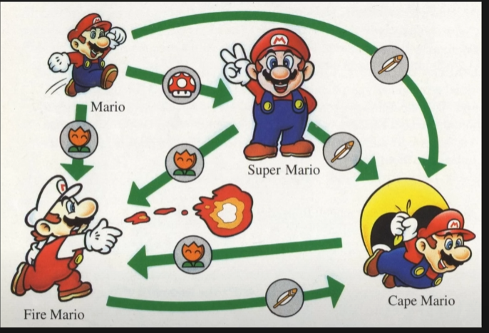
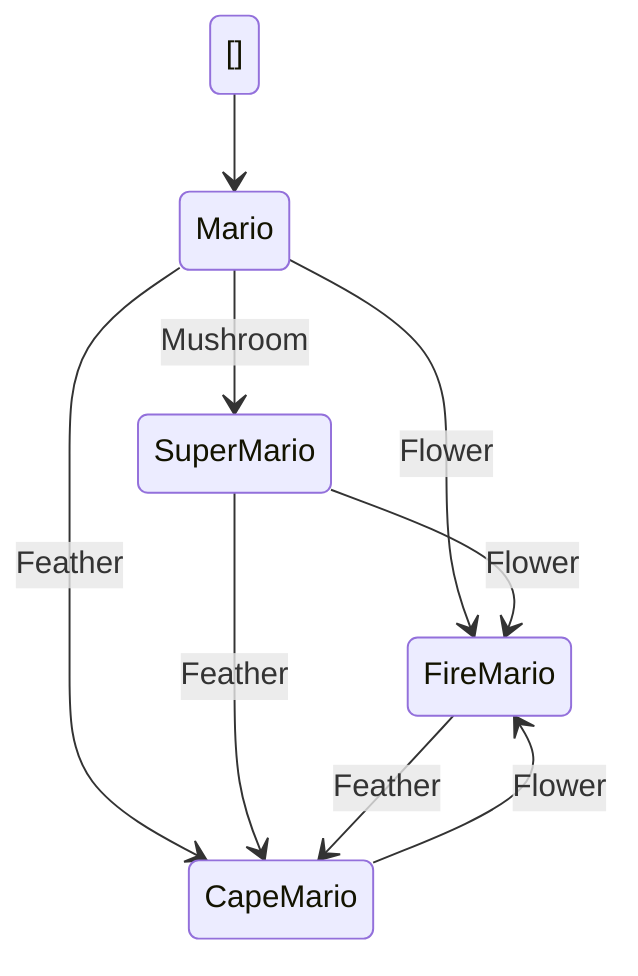

# Super Mario State Machine Generator

This project demonstrates a Finite State Machine (FSM) implementation using the Super Mario power-up system as an example, and provides a generator to convert Mermaid state diagrams into C# state machine code.

## Project Overview

The solution consists of three main projects:

1. **SuperMarioExample**: A working implementation of the Super Mario power-up state machine
2. **SuperMarioStateMashineTests**: Comprehensive unit tests for the state machine
3. **StateMachineGenerator**: A tool to generate state machine code from Mermaid diagrams

## Technical Stack

- .NET 9.0
- C# with nullable reference types enabled
- NUnit 4.2.2 for testing
- Newtonsoft.Json 13.0.3
- System.CommandLine for CLI support

## Super Mario State Machine Example

The Super Mario state machine is based on the power-up system from Super Mario games:



### Example Mermaid Diagram (mario.mmd)



### State Machine Implementation

The example implementation demonstrates:

1. **Clean State Pattern**: Each state is a separate class implementing `IMarioState`
2. **Type-Safe Transitions**: Enum-based state and transition definitions
3. **Logging Support**: Optional state transition logging via `MarioLogger`
4. **Extensible Design**: Easy to add new states or transitions
5. **Modern C# Features**: Nullable reference types, pattern matching

## State Machine Generator

The generator converts Mermaid state diagrams into fully functional C# state machine code. It generates:

1. Base interface and state classes
2. State and transition enums
3. Main state machine class with logging support
4. Unit tests for all states and transitions

### Usage

1. Create a Mermaid state diagram file (e.g., `mario.mmd`) following the format above
2. Run the generator:
```bash
dotnet run --project StateMachineGenerator -- --input mario.mmd --output GeneratedCode --namespace MyStateMachine --baseclass Mario
```

### Generated Code Structure

The generator creates a complete state pattern implementation:

1. Base Interface (`IMarioState.cs`):
```csharp
public interface IMarioState
{
    IMarioState HandleMushroom();
    IMarioState HandleFeather();
    IMarioState HandleFlower();
    Mario.State GetStateEnum();
}
```

2. State Classes (e.g., `MarioState.cs`):
```csharp
public class MarioState : IMarioState
{
    public IMarioState HandleMushroom() => new SuperMarioState();
    public IMarioState HandleFeather() => new CapeMarioState();
    public IMarioState HandleFlower() => new FireMarioState();
    public Mario.State GetStateEnum() => Mario.State.Mario;
}
```

3. Main State Machine (`Mario.cs`):
```csharp
public class Mario
{
    private IMarioState _currentState;
    private readonly MarioLogger _logger;

    public Mario(MarioLogger logger = null)
    {
        _currentState = new MarioState();
        _logger = logger;
    }

    public State GetItem(Transition transition)
    {
        var oldState = _currentState.GetStateEnum();
        _currentState = transition switch
        {
            Transition.Mushroom => _currentState.HandleMushroom(),
            Transition.Flower => _currentState.HandleFlower(),
            Transition.Feather => _currentState.HandleFeather(),
            _ => throw new ArgumentException($"Invalid transition: {transition}")
        };
        _logger?.LogStateTransition(oldState, _currentState.GetStateEnum(), transition);
        return _currentState.GetStateEnum();
    }
}
```

## Generated Project Structure

```
GeneratedCode/
├── Mario.cs                # Main state machine class
├── States/                 # Generated state classes
│   ├── IMarioState.cs     # Base interface
│   ├── MarioState.cs      # Initial state
│   ├── SuperMarioState.cs # Powered-up state
│   ├── FireMarioState.cs  # Fire power state
│   └── CapeMarioState.cs  # Cape power state
└── Tests/                 # Generated unit tests
    ├── MarioStateTests.cs
    ├── SuperMarioStateTests.cs
    ├── FireMarioStateTests.cs
    └── CapeMarioStateTests.cs
```

## Testing

Run the comprehensive test suite:
```bash
dotnet test
```

The test project uses:
- NUnit 4.2.2 (Latest version)
- NUnit3TestAdapter 4.6.0
- Microsoft.NET.Test.Sdk 17.12.0
- Coverlet for code coverage

### Test Coverage

The generated tests verify:
- All possible state transitions
- Invalid transitions
- State persistence
- Transition logging
- Error handling

## Getting Started

1. Clone the repository
2. Build the solution:
```bash
dotnet build
```

3. Generate a state machine from the example:
```bash
dotnet run --project StateMachineGenerator -- --input mario.mmd --output GeneratedCode --namespace MyStateMachine --baseclass Mario
```

4. Run the tests:
```bash
dotnet test
```

## Contributing

Feel free to contribute by:
1. Creating issues
2. Submitting pull requests
3. Improving documentation
4. Adding new features to the generator

## License

MIT License - feel free to use in your own projects.
